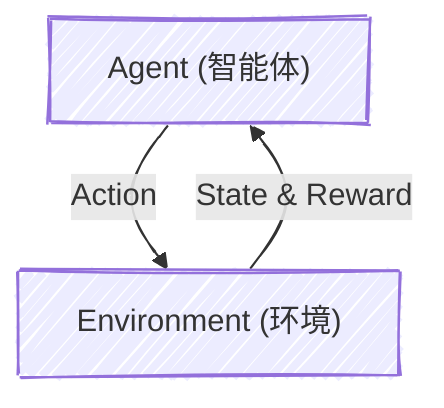

# 强化学习 Chapter 1 —— 核心概念与大模型视角的重构

> 如果说 Pre-training 赋予了 LLM 认识世界的基础知识，那么 Post-training（本质上是某种形式的强化学习）则赋予了它们与人类价值观对齐、进行复杂逻辑推理的能力。理解强化学习（RL），是我们真正理解当前 LLM 能力边界的必经之路。

从本质上看，强化学习（Reinforcement Learning）研究的是一个序列决策问题：**智能体（Agent）如何在与环境（Environment）的不断交互中，通过试错与反馈（Reward），学习到一个能最大化长期收益的策略（Policy）。**

## 1. 拆解马尔可夫决策过程 (MDP)

大多数强化学习的理论框架都可以用马尔可夫决策过程（MDP）来形式化。我们先来看构成这个世界交互循环的最基础元素：

* **State ($s_t$)**：环境当前的状态反映。
  * 传统的控制任务：机器人的关节角度、摄像头的像素信息。
  * **LLM 的语境：State 实际上就是输入的 Prompt 加上目前为止已经生成的所有上下文 (Context)。**

* **Action ($a_t$)**：Agent 做出的行为，受到动作空间 (Action Space) 的约束。
  * 在游戏里是上下左右，**在大模型生成中，Action 就是从词表 (Vocabulary) 里采样出的“下一个 Token”。**

* **Reward ($r_t$)**：环境基于当前状态和动作给出的反馈评估。
  * 传统 RL 中，Reward 通常是由环境规则硬编码的（比如下赢一盘棋得1分）。
  * Reward 可以被神经网络建模。

> **Reward Hacking 与 RM 的困境**
>
> * 在 RLHF（基于人类反馈的强化学习）中，环境并没有一个绝对客观的数学规则来告诉你“这个生成结果好不好”，因此我们必须训练一个额外的 **Reward Model (RM)** 来模拟环境，给 LLM 的输出打分。
> * 但这极易引入 **Reward Hacking**（奖励欺骗）问题——Policy 会不可避免地过度优化，发现并利用 RM 的分布外漏洞，生成一些看似高分但实际上狗屁不通、或是极度谄媚的废话。这正是目前对齐研究中最核心的挑战之一。

## 2. 策略 (Policy)：Agent 的“大脑”

Policy 决定了 Agent 在给定状态下应该采取什么行动。在 RL 的范式下，我们通常将其抽象为两种：

| 策略类型 | 数学表达 | 含义与特性 |
| :--- | :--- | :--- |
| **Deterministic (确定性)** | $a_t = \mu_\theta(s_t)$ | 给定状态，动作是唯一的。不具备探索能力。 |
| **Stochastic (随机性)** | $a_t \sim \pi_\theta(\cdot \mid s_t)$ | 给定稳定，输出动作的分布。有利于探索环境。 |

在现代深度强化学习（Deep RL）中，Policy 本质上就是一个多层神经网络（由参数 $\theta$ 表征）。

> **微调的对象本质上就是一张概率表**
>
> * 当我们在训练 LLM 时，模型本身就是一个极其庞大的 **Stochastic Policy** $\pi_\theta$。在给定前文 $s_t$ 时，LLM 计算出的 logits 经过 Softmax 后，就是在拟合一张关于所有潜在 Token $a_t$ 的概率分布表。
> * RL 算法中更新模型参数 $\theta$，根本目的就是推高那些能获得高 Reward 的生成轨迹（Trajectories）出现的概率。在 RL 阶段开始前，我们的初始 Policy 通常就是那个经过了 SFT (Supervised Fine-Tuning) 训练的模型。

## 3. 轨迹 (Trajectories) 与环境转移

我们将 Agent 与环境交互产生的一系列状态与动作构成的序列称为一条**轨迹 (Trajectory)**，在工程文献里它也常被称为 **Episode** 或 **Rollout**：
$$
\tau = (s_0, a_0, r_0, s_1, a_1, r_1, \dots)
$$

这个演化过程强依赖于**状态转移概率**:
$$
P(s_{t+1}|s_t, a_t)
$$
只要给定当前 State 和 Action，下一个 State 的概率分布就随之确定下来，这被称为**马尔可夫性 (Markov Property)** —— 未来状态仅仅取决于当前，与历史路径无关。

> **明确转移极大地简化了问题**
>
> 对于 LLM 而言，环境的状态转移是**完全确定 (Deterministic)** 的（策略随机，但状态转移确定）。因为当前 Context ($s_t$) 拼上新生成的 Token ($a_t$)，就物理意义上严丝合缝地构成了下一个 Context ($s_{t+1}$)。这也是为什么在 LLM 对齐算法中，我们往往可以做一些独特的工程简化（诸如 DPO 等直接对齐算法，甚至直接绕开显式的 Reward 建模，利用语言生成的确定性转移特征直接在偏好数据上优化策略网络）。

## 4. 回报 (Return)：我们要优化的终极目标

强化学习解决的是长视野问题（Long-horizon problem）。单步的 Reward $r_t$ 并不能反映全局的好坏（国际象棋里有时必须通过献祭棋子来换取最终的绝杀）。因此，RL 的优化目标是**最大化一条轨迹上的累计期望奖励**，我们称之为 **Return**。

最常见的形式是带折扣因子 (Discount Factor) 的回报：
$$
R(\tau) = \sum_{t=0}^{\infty} \gamma^t r_t \quad (\gamma \in [0, 1])
$$

引入 $\gamma$ 既能在数学上通过压缩映射保证无限步级数情况下的收敛性，也直观反映了一种“衰减”特质：离当下越远的奖励，因其包含的物理不确定性更高，因此权重应当被衰减。

> **KL 惩罚作为 Reward Shaping**
>
> 在 LLM 的标准强化学习 pipeline 中，我们常常只关注整段输出结束后的**句子级 (Sequence-level) 回报**。然而，为了防止 Policy 在追逐高分的过程中灾难性遗忘，或彻底丢失原有文本分布（崩塌为仅输出高分句式的复读机），我们不仅要优化 RM 给出的评分，还会在每个 Token 级别或 Sequence 级别引入一个与基座模型（Reference Model）的 **KL 散度惩罚项**。这个惩罚本质上是一种 **Reward Shaping**（奖励整形），时刻牵引着 $\pi_\theta$：“去追求高分，但千万别在分布上偏离常人的表达太远。”

## 5. 价值函数 (Value Function)：衡量长期潜力的标尺

单看眼前的单步 Reward 或者一条特定的轨迹往往是“盲人摸象”的。由于 Policy 和环境大都有随机性（Stochastic），我们更关心的是：站在当前的状态 $s$，或者在状态 $s$ 决定走哪一步棋 $a$ 的时候，**未来期望的总收益**有多大？

这就是**价值函数 (Value Function)** 尝试回答的问题，它衡量的是一个状态或动作的“全局长期潜力”。主要分为两类：

*   **状态价值函数 (State-Value Function, $V(s)$)**：在状态 $s$ 下，Agent 开始遵循策略 $\pi$ 走到时间尽头，期望获得的累积 Return。

$$
V^\pi(s) = \mathbb{E}_{\tau \sim \pi} \left[ R(\tau) \mid s_0 = s \right]
$$

*   **动作价值函数 (Action-Value Function, $Q(s, a)$)**：在状态 $s$ 下，Agent **先硬性执行动作 $a$**，之后再遵循策略 $\pi$ 走完余生，期望获得的累积 Return。

$$
Q^\pi(s, a) = \mathbb{E}_{\tau \sim \pi} \left[ R(\tau) \mid s_0 = s, a_0 = a \right]
$$

> **Value Function 是生成模型背后的“隐形裁判”**
>
> 不仅仅是经典的 PPO 算法依赖 Critic 网络来估计 Value Function，在最新的大模型推理探索链（如 OpenAI o1 及其衍生的树搜索扩展）或是基于过程奖励模型 (PRM, Process Reward Model) 的搜索中，模型在思考中间步骤（Intermediate Steps）时的剪枝与扩展，本质上都在利用 Value Function 的思想去衡量“当前这一步推理虽然还没到最终答案，但它通往正确答案的潜力究竟有多大”。

#### 价值函数的关系

在 LLM 语境下，状态 $s$ 和动作 $a$ 都是离散的：
$$
V^\pi(s)=E_{a\sim\pi}[Q^\pi(s,a)]=\sum_{a}\pi(a|s)Q^\pi(s,a)
$$
$Q^\pi(s,a)$ 等于即时反馈 $r$ + 下一状态的 state-value $V^\pi(s')$：
$$
Q^\pi(s,a)=r(s,a)+\gamma\sum_{s'}P(s'|s,a)V^\pi(s')
$$

## 6. 贝尔曼方程 (Bellman Equation)：将未来拆解为当下

理解了价值函数之后，强化学习最重要的数学根基便浮出了水面：**贝尔曼方程 (Bellman Equation)**。

无限期的 Return 期望看似是一个需要穷举未来所有路经才能解析的庞然大物，但贝尔曼方程巧妙地利用了马尔可夫性，将未来的价值拆分成了极其优雅的两部分：**即时奖励 + 下一状态的折扣未来价值**。

对于状态价值函数，它的贝尔曼期望方程展开如下：
$$
V^\pi(s) = \mathbb{E}_{a \sim \pi, s' \sim P} \left[ r(s,a) + \gamma V^\pi(s') \right]
$$

这一递推结构是深度强化学习几乎所有算法的灵魂底色。它意味着，为了更新当前状态的价值评估，我们根本不需要等待轨迹走到游戏通关；我们完全可以利用**自举 (Bootstrapping)** 的思想，用下一个状态的“估计价值”反过来更新当前的“估计价值”。大名鼎鼎的 Q-learning 和各种时序差分 (TD) 算法正立足于此。

## 7. 优势函数 (Advantage Function)：好与坏的“相对论”

在更新策略时，“只知道一个动作能拿到高分”是不够的。比如在股市大牛市里（环境状态总体极佳），随便买只股票（任意 Action）都能赚钱。我们真正需要知道的是：**这个动作 $a$ 比常规预期的平均水平好多少？**

这就是**优势函数 (Advantage Function)** $A(s, a)$ 的物理直觉：
$$
A^\pi(s, a) = Q^\pi(s, a) - V^\pi(s)
$$

它剔除了状态本身的基准难度——如果 $A(s, a) > 0$，说明这个动作比系统平均估计更优秀，应该增加采取该动作的概率；反之则应该抑制。

> **方差缩减 (Variance Reduction) 也是 RLHF 稳定的关键**
>
> 为什么在训练 LLM 的 PPO（Proximal Policy Optimization）阶段，不直接用单步或单句 Reward 更新，而是必须费时费力地再拉起一个 Critic 模型去计算 Advantage？
> 这是因为在人类语言生成这个无限庞大且极其稀疏的动作空间中，单靠 Reward 进行梯度估计的方差极大，极易导致策略在错误的方向上剧烈震荡崩溃。通过广义优势估计 (GAE) 把 Advantage $\hat{A}$ 作为权重乘在 Actor 网络的梯度上，相当于为模型找了一个极其稳定且合理的相对参照系，这也是保障 RLHF 最终收敛的定海神针。

---
**References:**

* [Spinning Up in Deep RL](https://spinningup.openai.com/en/latest/user/introduction.html)
* Mathematical Foundations of Reinforcement Learning. https://github.com/MathFoundationRL

## 附录

#### 1. 贝尔曼期望方程：状态价值函数推导

$$
\begin{aligned}
V^\pi(s)&=\sum_{a}\pi(a|s)Q^\pi(s,a)\\
&=\sum_{a}\pi(a|s)[r(s,a)+\gamma\sum_{s'}P(s'|s,a)V^\pi(s')]\\
&=\sum_{a}\pi(a|s)r(s,a)+\gamma\sum_{a}\pi(a|s)\sum_{s'}P(s'|s,a)V^\pi(s')\\
&=E_{a\sim \pi}[r(s,a)]+\gamma E_{a\sim\pi}[E_{s'\sim P}[V^\pi(s')]]\\\\
&=E_{a\sim\pi,s'\sim P}[r(s,a)+\gamma V^\pi(s')]
\end{aligned}
$$

**向量形式**

状态价值函数可写为
$$
V_\pi(s)=r_\pi(s)+\gamma\sum_{s'}P_\pi(s'|s)V_\pi(s')
$$
其中
$$
\begin{aligned}
&V_\pi = [V_\pi(s_1),...,V_\pi(s_n)]^T\in \R^n\\
&r_\pi = [r_\pi(s_1),...,r_\pi(s_n)]^T\in \R^n\\\\
&P_\pi\in R^{n\times n}\ \and \ [P_\pi]_{ij}=p_\pi(s_j|s_i)
\end{aligned}
$$
所以
$$
V_\pi=r_\pi+\gamma P_\pi V_\pi
$$

#### 2. 贝尔曼期望方程：动作价值函数推导

$$
\begin{aligned}
Q^\pi(s,a)&=r(s,a)+\gamma\sum_{s'}P(s'|s,a)V^\pi(s')\\
&=r(s,a)+\gamma\sum_{s'}P(s'|s,a)\sum_{a}\pi(a'|s)Q^\pi(s,a')\\
&=r(s,a)+\gamma\sum_{s'}P(s'|s,a)E_{a'\sim\pi}[Q(s,a')]\\
&=r(s,a)+\gamma E_{s'\sim P,a'\sim\pi}E[Q(s',a')]\\\\
&=E_{a'\sim \pi, s'\sim P}[r(s,a)+\gamma Q(s',a')]
\end{aligned}
$$

